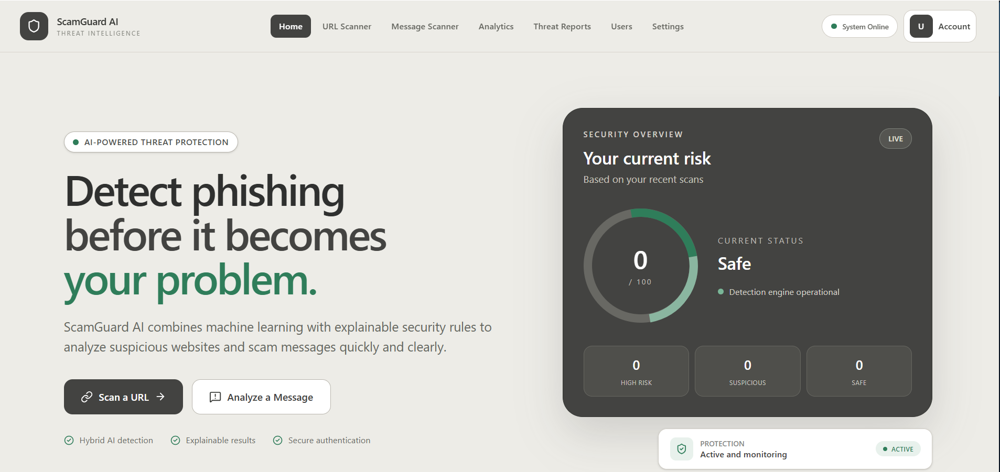
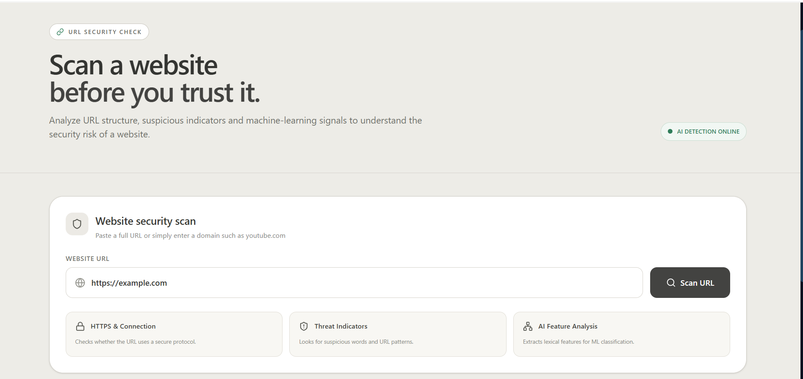
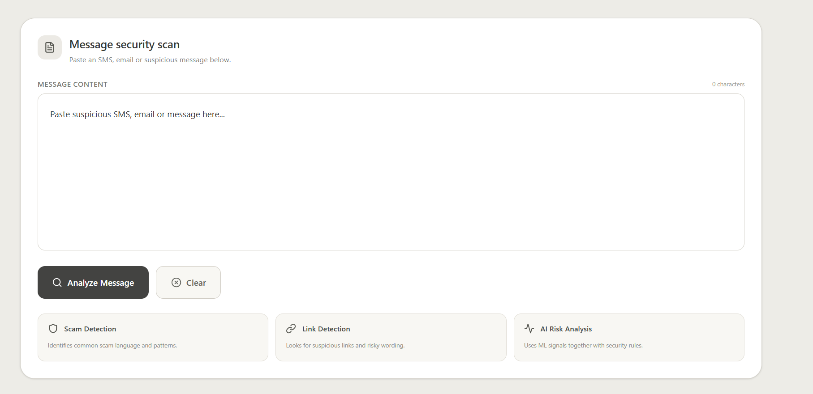

# 🛡️ AI-Powered Phishing & Scam Detection System

**A full-stack AI security platform for detecting phishing URLs and scam/spam messages.**

## Overview

The AI-Powered Phishing & Scam Detection System is a web application that analyzes suspicious URLs and messages using a combination of machine learning and rule-based security checks.

It provides:

URL phishing detection

Message spam/scam detection

Risk scoring and confidence analysis

Threat history and detailed reports

Analytics and ML evaluation

CSV and PDF report generation

JWT-based authentication and protected APIs

Screenshots

Home Dashboard

URL Scanner

Message Scanner

How It Works

URL / Message
      ↓
Input Validation
      ↓
Machine Learning Analysis
      +
Rule-Based Security Checks
      ↓
Risk Score + Confidence
      ↓
Final Security Decision
      ↓
MongoDB
      ↓
Analytics + Threat Reports

The system uses separate services for the application, API, and machine learning layer.

Core Features

🔗 URL Phishing Detection

Validates HTTP/HTTPS URLs

Extracts 18 URL features

Uses a Random Forest classifier

Applies rule-based detection

Includes trusted-domain protection

Produces a 0–100 risk score

Returns SAFE, SUSPICIOUS, or HIGH RISK

Displays model prediction and confidence

💬 Message Scam Detection

Validates submitted messages

Converts text using TF-IDF

Uses Logistic Regression

Applies rule-based checks

Generates risk score and confidence

Shows detection reasons

📊 Analytics

Total scans

URL and message statistics

Risk distribution

Threat categories

Recent activity

Daily scan activity

ML prediction distribution

Model evaluation data

📄 Threat Reports

Searchable scan history

Risk and type filters

Detailed scan information

Detection findings

ML prediction details

URL feature information

CSV export

PDF report generation

🔐 Authentication & Security

User registration and login

JWT authentication

Password hashing with bcrypt

Protected API routes

Rate limiting

CORS protection

Helmet security headers

Request size limits

Input validation

⚙️ Settings & User Management

Account information

Security preferences

Threat notifications

Password change

User search and profile view

Secure logout

The current application uses the User role. Admin and Analyst role-based access control are planned future improvements.

Machine Learning

SMS Spam Detection

Pipeline

Message
   ↓
TF-IDF Vectorization
   ↓
Logistic Regression
   ↓
Spam / Ham

Model artifacts

spam_model.pkl

tfidf_vectorizer.pkl

Reported held-out accuracy: 97.40%

URL Phishing Detection

Pipeline

URL
 ↓
18 Feature Extraction
 ↓
Random Forest
 ↓
Legitimate / Phishing

Model artifact

url_phishing_model.pkl

Reported held-out accuracy: 99.57%

URL Features

#

Feature

1

URL Length

2

Hostname Length

3

Path Length

4

Dot Count

5

Hyphen Count

6

Slash Count

7

Question Mark Count

8

Equal Sign Count

9

At Symbol Count

10

Percent Count

11

HTTPS

12

HTTP

13

IP Address

14

Suspicious Word Count

15

Subdomain Count

16

Digit Count

17

Letter Count

18

Shortened URL

Technology Stack

Layer

Technologies

Frontend

React, Vite, JavaScript, Tailwind CSS, Lucide React

Backend

Node.js, Express, Mongoose, JWT, bcryptjs, Axios

Security

Helmet, CORS, express-rate-limit

Database

MongoDB Atlas

ML Service

Python, Flask, Scikit-learn, Joblib

ML Models

TF-IDF + Logistic Regression, Random Forest

Reporting

PDFKit, CSV export

Deployment

Vercel, Render, MongoDB Atlas

Project Structure

AI-Powered-Phishing-Scam-Detection-System/
├── frontend/
│   ├── src/
│   │   ├── pages/
│   │   ├── api.js
│   │   └── App.jsx
│   └── package.json
│
├── backend/
│   ├── config/
│   ├── controllers/
│   ├── middleware/
│   ├── models/
│   ├── routes/
│   ├── services/
│   ├── utils/
│   ├── app.js
│   ├── server.js
│   └── package.json
│
├── ml-service/
│   ├── app.py
│   ├── url_model.py
│   ├── train_model.py
│   ├── train_url_model.py
│   ├── requirements.txt
│   ├── spam_model.pkl
│   ├── tfidf_vectorizer.pkl
│   └── url_phishing_model.pkl
│
├── home_1.png
├── url.png
├── message.png
└── README.md

API

Authentication

POST /api/auth/register
POST /api/auth/login
PUT  /api/auth/change-password

Scanning

POST /api/scan/url
POST /api/scan/message

Reports & Analytics

GET /api/reports
GET /api/reports/:scanId/pdf
GET /api/analytics

Users

GET /api/users
PUT /api/users/profile

Health

GET /api/health

Run Locally

1. Clone

git clone https://github.com/soni-701/AI-Powered-Phishing-Scam-Detection-System.git
cd AI-Powered-Phishing-Scam-Detection-System

2. Frontend

cd frontend
npm install
npm run dev

3. Backend

cd backend
npm install
npm start

4. ML Service

cd ml-service
pip install -r requirements.txt
python app.py

Run the three services separately.

Environment Variables

Backend — backend/.env

PORT=5000
MONGO_URI=your_mongodb_connection_string
JWT_SECRET=your_jwt_secret
ML_SERVICE_URL=http://localhost:8000

Frontend — frontend/.env

VITE_API_URL=http://localhost:5000

Never commit real credentials or secrets to GitHub.

Deployment

The production setup uses:

Vercel
  ↓
React Frontend
  ↓
Render Node/Express Backend
  ↓
MongoDB Atlas

Render Flask ML Service
  ↑
Node/Express Backend

Deployed Services

Backend

https://ai-powered-phishing-scam-detection.onrender.com

ML Service

https://ai-powered-phishing-scam-detection-system.onrender.com

Security Notes

The application includes multiple defensive layers:

Authentication with JWT

Password hashing

Protected routes

Rate limiting

CORS restrictions

Helmet security headers

Input validation

Request-size protection

Environment-based secret management

ML + rule-based detection

Future Improvements

Admin and Analyst role-based access control

Real-time threat intelligence

Larger training datasets

Continuous model retraining

Email phishing detection

Browser extension

Advanced audit logs

Automated security notifications

Disclaimer

This project is an AI-assisted security tool. Detection results should be treated as an additional security signal and not as a guarantee that a URL or message is completely safe or malicious.

Author

Soni Yadav

GitHub: soni-701

Repository: AI-Powered-Phishing-Scam-Detection-System
